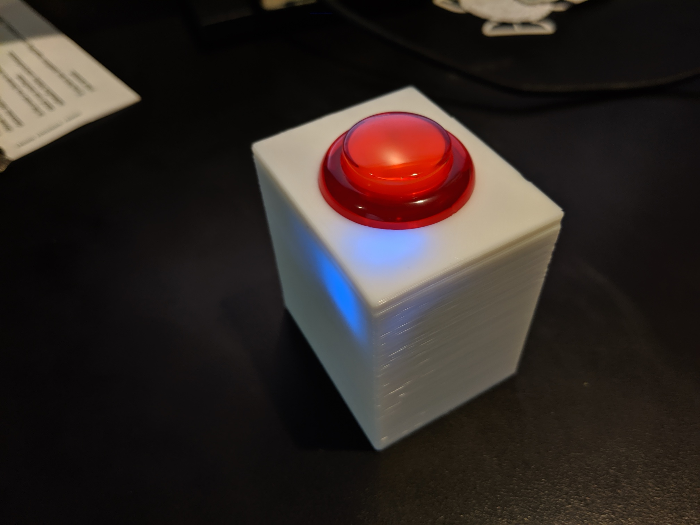

A hardware project + Chrome extension that works as an external mute button for [Google Meet](https://support.google.com/meet/answer/7290445?hl=en). I got tired of searching for the on-screen mute button while in videoconferences, so I put this together. It works by simply acting as a Bluetooth keyboard and sending a specific keypress when the button is pressed, which the Chrome extension handles.

The microcontroller software is in the [`arduino`](arduino) directory. The Chrome extension is in the [`extension`](extension) directory.

Hardware used:
* Microcontroller: [Adafruit Feather 32u4 Bluefruit LE](https://www.adafruit.com/product/2829) $29.95
* Battery: [Lithium Ion Polymer Battery - 3.7v 350mAh](https://www.adafruit.com/product/2750) $6.95
* Button: [Arcade Button with LED - 30mm Translucent Red](https://www.adafruit.com/product/3489) $2.50
* Wiring: [Arcade Button Quick-Connect Wire Pairs - 0.11" (10 pack)](https://www.adafruit.com/product/1152) $4.95

Total cost ~$45 (prices from Adafruit as of 2019-05-17).

Additionally I designed an enclosure in [Onshape](https://cad.onshape.com/documents/e020ad4b72619ced01a6f00b/w/b2792ebff70adeac4f74c80e/e/dbf084b0af3886f335cab50c). STL files to come when I finalize the design.

